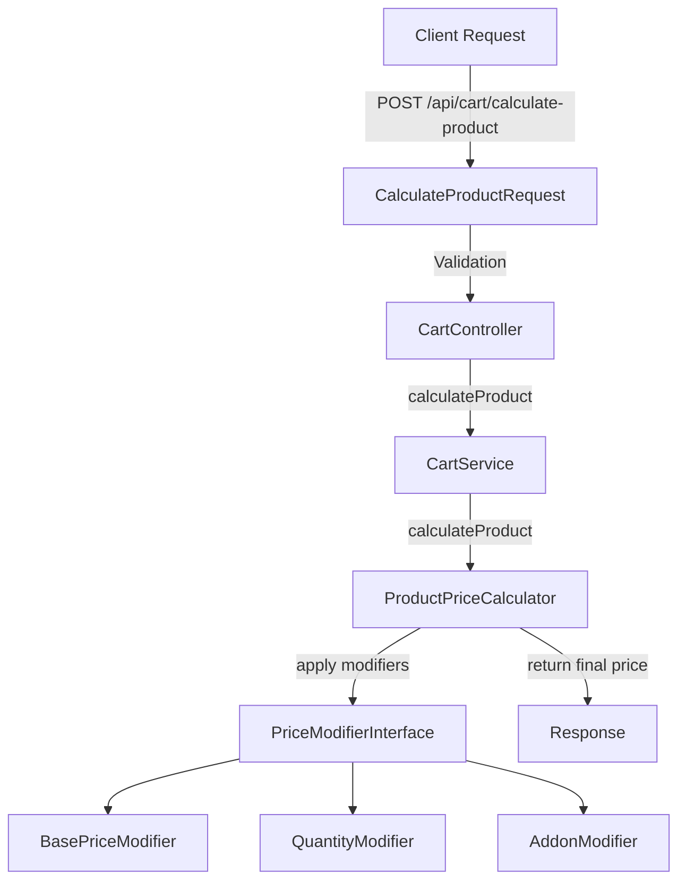

# Product Price Calculation System

## Overview

The product price calculation system uses a simple and flexible **Price Modifiers** pattern that allows calculating the final product price based on multiple factors:
- Base price of the product or SubProduct (based on weight/size)
- Selected quantity
- Selected addons

## Architecture



## API Endpoint

### Calculate Product Price

**Endpoint:** `POST /api/cart/calculate-product`

**Authentication:** Required (`auth:api`)

**Request Body:**
```json
{
    "product_id": 1,
    "quantity": 2,
    "size_id": 5,
    "addon_items": [10, 15, 20]
}
```

**Request Parameters:**

| Parameter | Type | Required | Description |
|-----------|------|----------|-------------|
| `product_id` | integer | Yes | Product ID |
| `quantity` | integer | Yes | Required quantity (minimum: 1) |
| `size_id` | integer | No | SubProduct ID (size/weight) |
| `addon_items` | array | No | Array of selected addon item IDs |

**Response Success:**
```json
{
    "status": "success",
    "message": null,
    "data": {
        "price": 150.50
    }
}
```

**Response Error (Validation):**
```json
{
    "status": "error",
    "message": "validation error messages",
    "data": null
}
```

## Price Calculation Flow

### Step 1: Request Validation
- Data validation is performed via `CalculateProductRequest`
- Verify product exists in database
- Validate quantity (minimum: 1)
- Validate `size_id` if provided
- Validate `addon_items` if provided

### Step 2: Get Product
- Fetch product from database using `Product::withoutGlobalScopes()`
- Prepare data for calculation

### Step 3: Apply Price Modifiers
Modifiers are applied in the following order:

#### 3.1 BasePriceModifier
- **Function:** Determine base price
- **Logic:**
  - If `size_id` is provided: Use the corresponding `SubProduct` price (replacement)
  - If `size_id` is not provided: Use the base `Product` price
- **Example:**
  ```
  Product price = 50
  OR
  SubProduct (size_id=5) price = 75
  ```

#### 3.2 QuantityModifier
- **Function:** Multiply price by quantity
- **Logic:** `final_price = base_price × quantity`
- **Example:**
  ```
  Base price = 75
  Quantity = 2
  Result = 75 × 2 = 150
  ```

#### 3.3 AddonModifier
- **Function:** Add prices of selected addons
- **Logic:**
  - Fetch all selected addons from `addon_items`
  - Sum their prices and add to current price
- **Example:**
  ```
  Current price = 150
  Addon 1 price = 5
  Addon 2 price = 10
  Addon 3 price = 15
  Result = 150 + 5 + 10 + 15 = 180
  ```

### Step 4: Return Final Price
- Final price is rounded to 2 decimal places
- Result is returned in Response

## Price Modifiers Details

### BasePriceModifier

**Location:** `Modules/Cart/App/Services/Product/PriceModifiers/BasePriceModifier.php`

**Responsibilities:**
- Determine base price from Product or SubProduct
- Verify SubProduct exists if `size_id` is provided
- Verify SubProduct is active (`is_active = true`)

**Example:**
```php
// Product with price = 50
// SubProduct (size_id=5) with price = 75

// Without size_id
BasePriceModifier → 50

// With size_id = 5
BasePriceModifier → 75
```

### QuantityModifier

**Location:** `Modules/Cart/App/Services/Product/PriceModifiers/QuantityModifier.php`

**Responsibilities:**
- Multiply price by selected quantity
- Ensure quantity is at least 1

**Example:**
```php
// Base price = 75
// Quantity = 3

QuantityModifier → 75 × 3 = 225
```

### AddonModifier

**Location:** `Modules/Cart/App/Services/Product/PriceModifiers/AddonModifier.php`

**Responsibilities:**
- Fetch selected addons from product
- Sum prices of selected addons
- Add sum of addon prices to current price

**Example:**
```php
// Current price = 225
// addon_items = [10, 15, 20]
// Addon 10 price = 5
// Addon 15 price = 10
// Addon 20 price = 15

AddonModifier → 225 + 5 + 10 + 15 = 255
```

## File Structure

```
Modules/Cart/
├── App/
│   ├── Http/
│   │   ├── Controllers/
│   │   │   └── CartController.php
│   │   └── Requests/
│   │       └── CalculateProductRequest.php
│   ├── Interfaces/
│   │   └── PriceModifierInterface.php
│   └── Services/
│       ├── CartService.php
│       └── Product/
│           ├── ProductPriceCalculator.php
│           └── PriceModifiers/
│               ├── BasePriceModifier.php
│               ├── QuantityModifier.php
│               └── AddonModifier.php
└── Routes/
    └── api.php
```

## Complete Calculation Example

### Scenario:
- Product ID: 1 (Base price: 50)
- Size ID: 5 (SubProduct price: 75)
- Quantity: 2
- Addon Items: [10, 15] (Prices: 5, 10)

### Calculation Steps:

1. **BasePriceModifier:**
   - Input: `size_id = 5`
   - Output: `75` (SubProduct price)

2. **QuantityModifier:**
   - Input: `base_price = 75`, `quantity = 2`
   - Output: `75 × 2 = 150`

3. **AddonModifier:**
   - Input: `current_price = 150`, `addon_items = [10, 15]`
   - Output: `150 + 5 + 10 = 165`

4. **Final Result:**
   - `165.00`

## Adding New Price Modifier

To add a new modifier (e.g., loyalty discount, shipping fees, etc.):

### Step 1: Create Modifier Class

```php
<?php

namespace Modules\Cart\App\Services\Product\PriceModifiers;

use Modules\Cart\App\Interfaces\PriceModifierInterface;

class LoyaltyDiscountModifier implements PriceModifierInterface
{
    public function calculate(float $basePrice, array $data): float
    {
        // Your calculation logic here
        $discount = 0.1; // 10% discount
        return $basePrice * (1 - $discount);
    }
}
```

### Step 2: Add to ProductPriceCalculator

```php
// In ProductPriceCalculator.php constructor
public function __construct()
{
    $this->modifiers = [
        new BasePriceModifier(),
        new QuantityModifier(),
        new AddonModifier(),
        new LoyaltyDiscountModifier(), // Add your new modifier
    ];
}
```

### Step 3: Update Data Array (if needed)

If the new modifier requires additional data, add it in `CartService::calculateProduct()`:

```php
$calculateData = [
    'product' => $product,
    'size_id' => $data['size_id'] ?? null,
    'quantity' => $data['quantity'] ?? 1,
    'addon_items' => $data['addon_items'] ?? [],
    'loyalty_points' => $data['loyalty_points'] ?? 0, // New data
];
```

## Benefits

- **Simple:** Each Modifier class is small and clear
- **Extensible:** Adding a new modifier = create a new class and add it to the array
- **Testable:** Each modifier can be tested separately
- **SOLID:** Follows Single Responsibility and Open/Closed principles
- **Maintainable:** Easy to maintain and develop

## Notes

- All price calculations are located in **Cart Module**, not Products Module
- Final price is rounded to 2 decimal places
- If `size_id` is not provided, the base Product price is used
- If `addon_items` is not provided or empty, no addon prices are added
- Quantity must be at least 1
